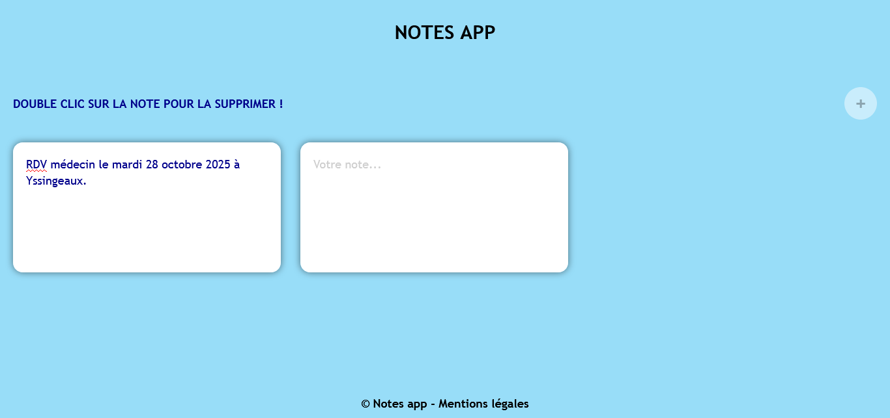

## NOTES APP

## Le challenge

Construction d'une notes app. L'utilisateur va pouvoir :

- créer une note qui va être sauvegarder dans le local storage du navigateur
- ajouter une nouvelle note en cliquant sur le bouton + (cette nouvelle note va également être sauvegardée dans le local storage)
- supprimer une note qui va également être supprimée dans le local storage en faisant un double clic sur celle-ci.

Le projet est responsive : il s'adapte aux différentes résolution d'écran (desktop, tablette et mobile)

## Démonstration

Lien vers le projet : https://aperbet56.github.io/notes_app/

## Projet développé avec

- Utilisation des balises sémantiques HTML5
- CSS3
- Flexbox
- Animations css
- Page web responsive
- JavaScript
- Code JavaScript commenté
- Desktop first
